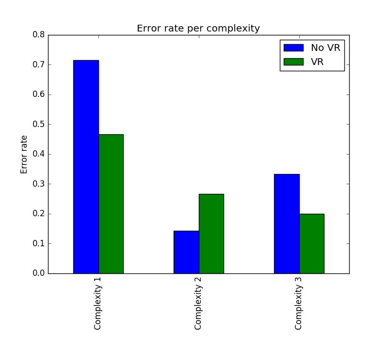
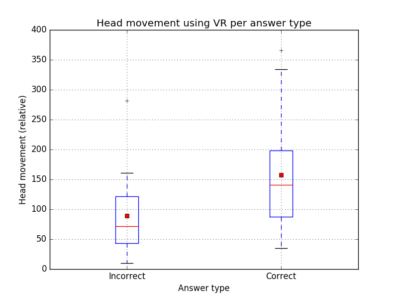
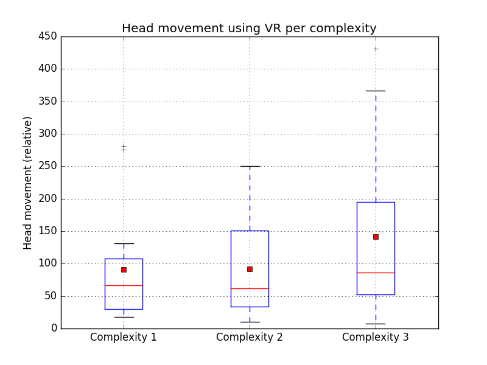
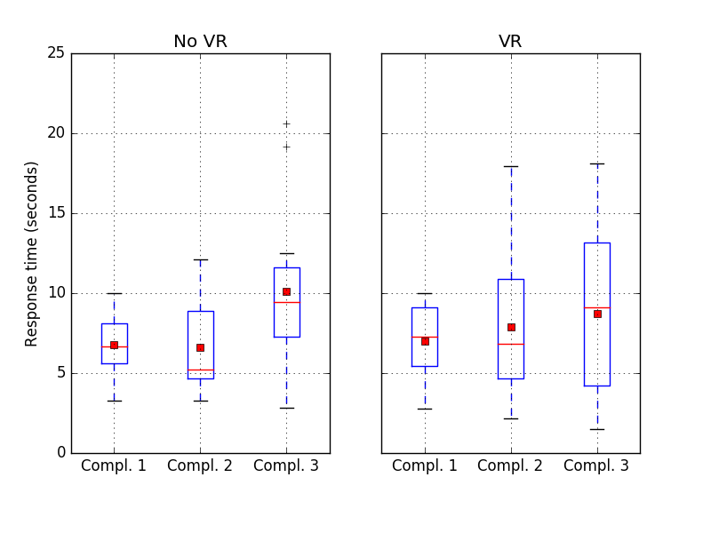

Interactive Virtual Environments project. Final Report
======================================================

Depth perception: Effects of Head Tracking in Analysing Graphs in 3D
--------------------------------------------------------------------

Allegretta, Mauro

Ambite, Diego

Lozano, Francisco J.

Rinsma, Thomas

### Date: November 2016

### Eindhoven University of Technology (TU/e)

1. Problem statement and research questions
-------------------------------------------

The main goal for this project is to replicate one of the experiments carried out in the provided paper *Evaluating Stereo and Motion Cues for Visualizing Information Nets in Three Dimensions*. This experiment consists of analyzing the difference between user comprehension of network graphs (1) in 2D versus 3D and (2) with and without head-tracking. This difference will be measured by having the user perform a simple task and recording several metrics such as timing and error rate. As a result of the experiment, we hope to be able to make conclusions about whether 3D vision and/or (lack of) head-tracking is better for the comprehension of visualized graphs.

In addition to the metrics proposed in the experiment, we will try to gain more insight of the effects of 3D vision and head-tracking by measuring additional metrics such us the distance traversed or the amount rotated by the head or the distance that the subject traverses inside the virtual environment. The purpose of these additional metrics is to test whether or not there exists a correlation between the complexity of the graph and the amount of movement that is required for the subject to comprehend it.

Finally, we will have to overcome some difficulties that could lead to the failure of the experiment. Some of these difficulties are:

-   Retrieve some metrics from Oculus Rift and get used to the Unity framework.

-   Design appropriate levels (of difficulty) for our analysis purpose in order to get useful data.

-   Interpret the data correctly to extract truthful and correct conclusions.

-   Technical difficulties/limitations regarding frame rate, graphics rendering, etc.

The questions that we will try to give answer to are the following ones:

-   Is it better in terms of comprehension to visualize network graphs in 2D or 3D?

-   Does head-tracking help increase this comprehension in addition to 3D vision?

-   Do these differences become bigger as we increase the complexity of the graph?

-   How similar are the obtained results to those in the original paper?

2. Related work
---------------

3. Experiment
-------------

### 3.1. General description

The experiment that we are performing has a main purpose to collect relevant and consistent data from the Oculus Rift device and the subjects regarding the effects of stereoscopic vision and head tracking in the task of 3D graph comprehension. In addition, we will create a series of scenarios to retrieve data regarding to the effects of visual memory in 3D graph comprehension when the range of vision is reduced.

This experiment is an extension of the one proposed in the study *Evaluating Stereo and Motion Cues for Visualizing Information Nets in Three Dimensions.* Whereas the effects of head tracking and 3D stereoscopic vision will be compared with the study, we will try to make some conclusions about the effects of visual memory on the performed task.

The experiment will be composed of **three stages**. Each one will be composed of **three scenarios** according to the graph complexity**.** The description of each stage is the following one:

1.  **Stage 1**: The subject performs the experiment in each scenario directly on the screen of a laptop. For this stage, no Oculus Rift device will be used and the subject will be able to visualize the graph looking at the screen, with no head tracking support.

2.  **Stage 2**: The subject performs the experiment in each scenario using the Oculus Rift device. Head tracking will be active and there will not be any kind of reduction of the angle of vision.

3.  **Stage 3**: The subject performs the experiment in each scenario using the Oculus Rift device, Head tracking will be active and there will be a reduction of ~50% of the range of vision both in horizontal and vertical axes.

Each stage will be composed by three scenarios with **challenges** whose level of difficulty goes from 1 to 3. A challenge will consist of answering if there exists a 2-length path connecting two highlighted nodes. Each challenge will have a 50% of probability of containing such a path. The subject will have to answer (yes or not) whether or not his path exists before the maximum time for the challenge is over. If the user has not made a decision before the time is over, it will count as a fail.

The complexity of the graph will be defined in terms of the number of nodes and edges in the graph. Each scenario will contain a graph with different complexity in increasing order. Due to the difficulty to determine the number of nodes and edges that fit best with each level of complexity, some testing will still be performed using different number of nodes and edges to design three complexity levels that have distinct average times needed to solve the problem in the experiment.

The estimated mean time to complete the three stages will depend on the maximum time we define for each level of complexity but it will not be more than 10 minutes. The estimated time for each stage will be in a range between 1 and 3 minutes and a mean time of 1 minute between each stage.

Finally, the experiment will be allowed to be repeated several times by a subject. The first attempt will be considered for the main study and the consecutive attempts will be taken into account for a possible secondary study about the adaptive process in each stage.

### 3.2. Constraints

For this experiment, we have defined some rules and constraints that will delimit the experiment's boundary and specify clearly what the subject can or can't do. The constraints are the following:

-   A maximum amount of time will be defined for each level of complexity. The range of maximum time will be somewhere between 10 seconds and 1 minute. This is an approximation and could be modified after the implementation of the experiment.

-   If the subject runs out of time for one level, the next level or stage will start and the challenge will be treated as failed.

-   The subject won't be allowed to stand up from the chair. He will be able to rotate his head and move it at any direction though.

-   A subject will be allowed to repeat the experiment a maximum of 3 times to avoid virtual reality sickness.

-   The subject will sit in a range between 60 centimeters and 1 meter in front of the laptop screen for Stage 1.

-   If the subject interrupts the experiment without completing all the stages and levels, the results will be discarded.

-   The subject won't be allowed to take out the Oculus Rift in Stages 2 and 3. If the subject takes out the OR during this stages, the experiment will be interrupted and the data collected will be discarded.

-   The subject won't be provided with any joystick to move inside the scenarios. He will have access to the mouse and/or keyboard to provide a yes or no answer to each experiment.

### 3.3. Research questions

In this section we are defining the different approaches that we will use to answer the research questions with the data collected in the experiment. The proposed research questions are the following ones:

-   *Does stereoscopy and head tracking add to a person's comprehension of 3D graphs?*

This question will be answered using the data collected from Stages 1 and 2. We will compare the difference of performance in terms of time and error rate. In addition, the subject will be asked at the end of the experiment to rate the experience in each stage. Data collected in these two stages will be compared among them to see if these techniques are really helpful and how much are they in terms of performance.

-   *Does there exist any correlation between the amount of head movement and the graph complexity when 3D graphs are visualized with a virtual reality device?*

This question will be answered using the data collected from Stages 2 and 3. We will measure the distance traversed by the head for each scenario and use this metric to see if the distance increases proportionally to the complexity of the graph.

-   *How important is the range of vision in comprehension of 3D graphs with stereoscopic vision? Does visual memory have any influence in the comprehension of 3D graphs?*

The second question is the most relative one because it depends on many factors that are hard to measure without special equipment. However, our approach of reducing the range of vision of the graph could give us some idea of how much the difference in the performance is in this scenario. We hypothesize that the reduction of the range of vision in Stage 3 will make the subject look several times in different directions to construct a memory image of the graph. This probably takes a certain amount of time that we will compare with the results obtained in Stage 2. Analysing the results, we will try to form a conclusion on how significant the use of visual memory is in the comprehension of 3D graphs.

-   *How similar are the obtained results with the findings in the original paper?*

This question will be answered using the data collected from Stages 1 and 2 and once the first question has been answered. We will make a comparison of the conclusions of our experiment and the paper and try to look for the reasons if the results are differences are significant enough.

Results
-------

### Transcription of the Thomas talk last presentation

Error rate per complexity and condition

We split it up the X axis in three complexity levels and the Y axis measures the error rate. The first thing interesting is that in the first and third complexity levels NO VR error rate is higher than VR. This is what we expected because VR should make easier the task of visualizing graphs but in the second complexity level is the other way round. We could not make a conclusion about this fact but if we take the mean of the percentage of correct answers, that is the inverse of the error rate, the percentage VR (68.89%) is slightly higher than the percentage without using VR (60.47%). This is not a big difference in performance, which is what we expected but may not be significant due to the lack of samples.

Independently if we use VR or not, the error rate in the first complexity level is a lot higher than the other two complexity levels. This means the opposite of what we expected and what we found in the original paper. That’s it, the error rate should increase proportionally to the level of complexity. The explanation we give for this is that the subjects that visualize the graphs for the first time must get used to the device and the experiment and it takes time to do it. We could say that this was an issue caused by the lack of familiarity with the device and the experiment. On the other hand, this could be also a problem related to the lack of gathered examples.

In this plot, we can see the amount of head movement in the Y axis. This is an interesting one because it wasn’t in the original paper. This is the total amount of head movement splitted it up in the cases when they made incorrect answers and correct answers. The amount of head movement increased a 30.19% percent for correct answer with respect incorrect answer. People that moves the head more to visualize the graph are more likely to do a correct answer. The head movement was measured using the movement of the camera in the virtual space in Unity units.

In this plot we have again the head movement in the Y axis and the X axis is splited up in three complexity levels. Specially for the third complexity level, the mean of head movement is slightly higher than the others. This was expected because the experiment was set up such that people in higher complexity levels have a higher maximum amount of time and thus, if they have more time, they tend to move their heads and it results in a higher amount of head movement in total. You can see also that the variance is very high in the third complexity level because people really liked the sensation at this point of the experiment and they moved a lot.

In these two box plots, we can see the response time in seconds in the Y axis, separated in VR and no VR and in the three complexity levels. We can see for both plots that the higher the graph complexity is, the is higher is the response time. This was of course expected because people have more time to make a decision because the maximum time is higher. We can also see that the variance if very high again for VR because people really liked the VR experience and some of them spent a lot of time.

If we observe the means and we compare them, we can see they are both practically the same in VR and No VR and this is not what we expected. Again, this could happened because of the sample size.

Appendix. Implementation
------------------------

For the implementation of this experiment, we will use Unity framework and Oculus Rift SDK. A controller class will be in charge of controlling the experiment flow across the different stages and scenarios. The controller will contain an internal timer that will control the remaining time for each scenario. The set of rules, such as maximum time and reduction of range of vision, used for each stage will be stored in a data structure.

The only interaction allowed with each scenario will be provided through the mouse. The subject will use the left mouse button to answer that the there exists a 2-length path between the highlighted nodes and the right mouse to give a negative answer. The rest of the interactions such as initiating the timer, change the scenarios or reduce the angle of vision will be than through the controller. No movement will be implemented inside the scenario.

The graphs will be randomly generated for each scenario using some defined constants according to the level of complexity of the graph. Some of this constants will be the number of edges and nodes and the probability of generating a 2-length path between two points. The graph will be undirected, with white edges connecting blue nodes. The highlighted points will be drawn in red and the background of the scenario will be black to improve the visibility of the graph.
